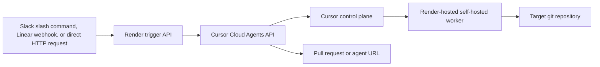

# Cursor self-hosted cloud agents on Render

Run Cursor self-hosted cloud agents on Render without Kubernetes.

This example deploys:

- a Render worker that runs `agent worker start`
- a small Node.js trigger API that launches Cursor Cloud Agents through the Cursor API
- optional Slack and Linear entrypoints for kickoffs and completion updates

Use this example to run Cursor workers on Render for teams that want self-hosted execution without managing Kubernetes.

## Why this exists

Cursor self-hosted cloud agents keep code and tool execution in your own network while Cursor handles orchestration and model access. The worker connects outbound over HTTPS, so you do not need inbound ports or VPN tunnels. That model fits Render well: you can run the worker as a managed background service and pair it with a small web service for triggers and notifications.

Useful references:

- [Cursor self-hosted cloud agents announcement](https://cursor.com/blog/self-hosted-cloud-agents)
- [Cursor self-hosted cloud agents docs](https://cursor.com/docs/cloud-agent/self-hosted)
- [Cursor Cloud Agents API](https://cursor.com/docs/cloud-agent/api/overview)
- [Cursor Slack integration](https://cursor.com/docs/slack)

## What this repo deploys



The default deployment uses two services:

- `cursor-trigger-api`: a public web service for incoming triggers
- `cursor-self-hosted-worker`: a long-lived background worker for Cursor sessions

More detail lives in [docs/architecture.md](docs/architecture.md).

## Why use a custom trigger API

Cursor already has a native Slack integration. This example uses a custom trigger service to provide:

- it gives you a single place to normalize Slack, Linear, and direct HTTP requests
- it lets you add org-specific routing, approvals, and logging
- it creates a clearer "deploy Cursor workers on Render" reference architecture

If you only need Slack, Cursor's native integration is a good option. If you want a Render-native automation layer, this example provides a starting point.

## Prerequisites

- A Cursor team plan with self-hosted agents enabled
- A Cursor API key
- A target git repository for the worker
- Git credentials on the worker if the target repository is private
- A Render account

For production, prefer a Cursor service account API key when your plan supports it. For quick testing, a personal API key also works.

## Deploy on Render

1. Fork or copy this repository to GitHub.
2. In Cursor, enable self-hosted agents in the Cloud Agents dashboard.
3. In Render, create a new Blueprint and point it at this repository.
4. Fill in the required environment variables.
   The Blueprint defaults `DEFAULT_CURSOR_MODEL` to `gpt-5.4-high-fast`.
   If your account does not support that model, query `GET /v0/models` and replace it with a supported ID.
5. Apply the Blueprint.
6. Open the deployed trigger service and confirm `GET /healthz` returns `ok: true`.
7. Open the Cursor Cloud Agents dashboard and confirm the worker appears as connected.

## Required environment variables

### Trigger API

- `CURSOR_API_KEY`: API key used to call the Cursor Cloud Agents API
- `CURSOR_TARGET_REPOSITORY`: the single repository this deployment will launch agents against
- `DEFAULT_CURSOR_MODEL`: explicit model ID for API-triggered runs. This Blueprint defaults to `gpt-5.4-high-fast`.
- `TRIGGER_HOST`: trigger service host used to build the public callback URL as `https://<host>.onrender.com`
- `CURSOR_WEBHOOK_SECRET`: shared secret for verifying Cursor webhook callbacks

For local development or non-Render deployments, you can set `TRIGGER_BASE_URL` as an override.
If your account does not support `gpt-5.4-high-fast`, query `GET /v0/models` with your Cursor API key and set `DEFAULT_CURSOR_MODEL` to one of the returned IDs.

### Optional provider variables

- `SLACK_SIGNING_SECRET`: required for Slack slash commands
- `LINEAR_WEBHOOK_SECRET`: required for Linear webhooks
- `LINEAR_API_KEY`: used to comment back on Linear issues

### Worker

- `CURSOR_API_KEY`: API key used by `agent worker start`
- `CURSOR_TARGET_REPOSITORY`: repository cloned into the worker at startup
- `CURSOR_TARGET_REF`: branch, tag, or commit to check out
- `CURSOR_GIT_TOKEN`: token used for private HTTPS clone, fetch, and push operations

The worker uses `CURSOR_TARGET_REPOSITORY` to clone a git checkout before starting Cursor. The trigger API uses the same repository setting and rejects mismatches. This keeps the repository identity explicit and avoids depending on the deployed app source tree.

## Trigger endpoints

### Direct HTTP

Send a task directly to the trigger API:

```bash
curl --request POST \
  --url https://your-trigger-service.onrender.com/v1/tasks \
  --header 'Content-Type: application/json' \
  --data '{
    "prompt": "Fix the flaky auth test",
    "notify": {
      "provider": "slack",
      "responseUrl": "https://hooks.slack.com/commands/..."
    }
  }'
```

### Slack

Point a Slack slash command at:

```text
POST /providers/slack/commands
```

Example command body:

```text
branch=main autopr=true Fix the flaky auth test
```

The trigger service verifies the Slack signature, launches a Cursor agent, and returns the agent URL immediately. If `TRIGGER_HOST` and `CURSOR_WEBHOOK_SECRET` are set, it also posts a completion update back to the same Slack thread via `response_url`.

### Linear

Point a Linear webhook at:

```text
POST /providers/linear/webhooks
```

The service listens for commands embedded in issue descriptions or new comments. By default, the command prefix is `@cursor`.

Examples:

```text
@cursor Fix the flaky auth test
```

```text
@cursor branch=main Summarize the failing CI job and open a PR
```

When `LINEAR_API_KEY` is configured, the service comments back on the issue when the run starts and when it finishes.

## How the worker starts

The worker container:

1. clones `CURSOR_TARGET_REPOSITORY`
2. optionally checks out `CURSOR_TARGET_REF`
3. starts Cursor with `agent worker start --worker-dir /workspace/repo`

The worker can also run in single-use mode:

```text
CURSOR_WORKER_SINGLE_USE=true
CURSOR_WORKER_IDLE_RELEASE_TIMEOUT=600
```

The default deployment uses a long-lived worker to reduce setup and keep capacity warm between runs.

## Single-repo deployment model

This deployment uses a single repository.

- The worker derives its Cursor `repo` label from the git remote it clones.
- The trigger API is pinned to the same `CURSOR_TARGET_REPOSITORY`.
- If you want to support multiple repositories, deploy one worker pool per repository and route requests to the matching pool.

## Sizing guidance

Start conservatively:

- Trigger API: `starter`
- Cursor worker: `standard`

This keeps the trigger service inexpensive while giving the worker more headroom for terminal-heavy tasks. If you expect browser-heavy runs, large repositories, or heavy test suites, move the worker up first.

## Security notes

- The worker only needs outbound HTTPS to Cursor.
- No inbound port is required for the worker.
- Secrets should be set in Render as environment variables, not committed.
- If the target repository is private, give the worker a dedicated git token with the read and write access needed for branch and pull request workflows.

## Local development

Copy `.env.example` to `.env` and set the values you need.

Run the trigger service locally:

```bash
cd apps/trigger
npm install
npm run dev
```

Build the worker image locally:

```bash
docker build -f docker/worker/Dockerfile -t cursor-render-worker .
```

Run the worker locally:

```bash
docker run --rm \
  -e CURSOR_API_KEY=your_key \
  -e CURSOR_TARGET_REPOSITORY=https://github.com/your-org/your-repo \
  -e CURSOR_GIT_TOKEN=your_git_token \
  cursor-render-worker
```

## Render Workflows

Render Workflows fit well as an orchestration layer for retries, polling, fan-out, and approval steps. They are not part of the default deployment because Workflows are still beta and are not yet compatible with `render.yaml` Blueprints.

See [docs/workflows-alternative.md](docs/workflows-alternative.md) for one way to add Workflows alongside this deployment.

## Possible extensions

- route different repositories based on team or channel
- add a queue or database for durable notification tracking
- switch the worker to single-use mode and provision capacity dynamically
- add approval gates before launching an agent
