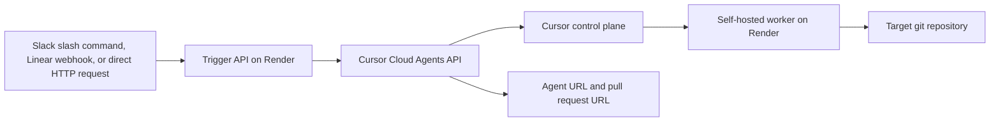

# Architecture

This repo uses two Render services:

- `cursor-trigger-api`: a public Node.js service that accepts trigger requests and calls the Cursor Cloud Agents API.
- `cursor-self-hosted-worker`: a long-lived Render worker that runs `agent worker start` against a git checkout.

This deployment uses a single repository: the worker is pinned to one target repository, and the trigger API is pinned to that same repository.

## Request flow



## Service layout

- The Render worker handles the self-hosted execution environment.
- The trigger API keeps provider-specific logic out of the worker container.
- The trigger API can support Slack, Linear, and direct API calls with one deployment.
- The deployment stays Blueprint-friendly because it uses a standard web service plus a standard worker service.
- The routing model is one deployment per repository.

## Long-lived worker versus single-use worker

| Mode | Best for | Tradeoff |
| --- | --- | --- |
| Long-lived worker | Simple first deployment, warm caches, predictable demo flow | Higher baseline cost because the worker stays connected |
| Single-use worker | Cleaner isolation and future autoscaling | More orchestration work and more moving parts |

The default deployment uses a long-lived worker. You can switch to single-use mode with `CURSOR_WORKER_SINGLE_USE=true` and an `idle-release-timeout` when you have a provisioning strategy around the worker lifecycle.

## Worker bootstrap model

The worker container clones `CURSOR_TARGET_REPOSITORY` at startup, then runs:

```bash
agent worker start --worker-dir /workspace/repo
```

This keeps the deployment portable across Render deploys and makes the repository identity explicit. The worker does not rely on a persistent local checkout.

## Networking

- The worker needs outbound HTTPS to `api2.cursor.sh` and `api2direct.cursor.sh`.
- The worker does not require inbound ports or VPN tunnels.
- The trigger API is the only public HTTP entrypoint in the default architecture.

## Authentication model

- For production, use a Cursor service account API key for both the trigger service and the worker.
- The worker also needs git credentials if the target repository is private.
- If you want the agent to open pull requests as the Cursor GitHub app, connect the GitHub integration at the team level in Cursor.

## Provider support in this repo

- Slack: slash-command style endpoint with signature verification and optional completion updates via `response_url`
- Linear: webhook endpoint with signature verification and optional issue comments on launch and completion
- Direct API: `POST /v1/tasks` for custom systems, internal tools, and scheduled automations
